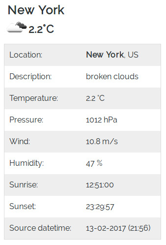
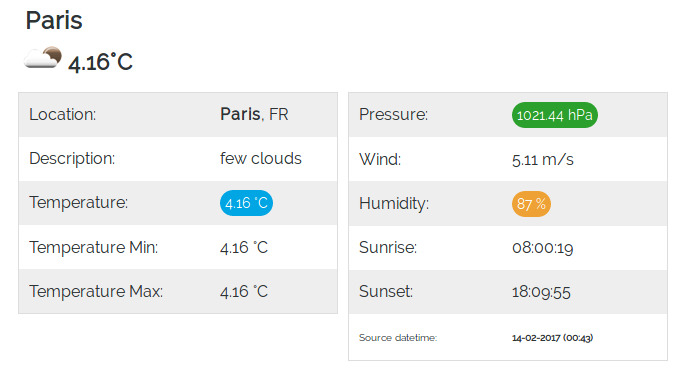
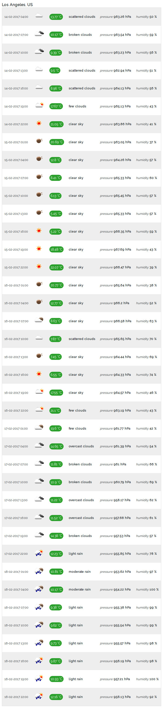

# 

[](https://packagist.org/packages/dwr/open-weather)
[![Software License][ico-license]](LICENSE.md)
[](https://travis-ci.org/dariuszwrzesien/DwrOpenWeather)
[](https://coveralls.io/github/dariuszwrzesien/DwrOpenWeather?branch=master)
[](https://scrutinizer-ci.com/g/dariuszwrzesien/DwrOpenWeather/?branch=master)
[](https://packagist.org/packages/dwr/open-weather)

# DwrOpenWeather

DwrOpenWeather is a simply wrapper for [Open Weather API](https://openweathermap.org/).  
In order to start please generate your personal ApiKey first.  
You can do it [here](http://openweathermap.org/appid).  
 
## Installation and usage

When you have ApiKey, installation and usage is very easy.

### Step 1: Download DwrOpenWeather using composer

Add DwrOpenWeather in your composer.json:

```json
    {
        "require": {
            "dwr/open-weather": "1.0.0"
        }
    }
```
or download it by running the command:

```bash
    $ php composer.phar update dwr/openweather
```

### Step 2: Use it in your application

#### GET Weather

```php
    // errors reporting
    ini_set('display_errors', 1);
    ini_set('display_startup_errors', 1);
    error_reporting(E_ALL);

    require __DIR__ . '/vendor/autoload.php';
    
    use Dwr\OpenWeather\Configuration;
    use Dwr\OpenWeather\OpenWeather;
    
    $apiKey = YOURS-API-KEY; //consider keeping api key in environment variable: getenv('OPEN_WEATHER_API_KEY'); 
    $openWeatherConfig = new Configuration($apiKey);
    
    $openWeather = new OpenWeather('Weather', $openWeatherConfig);
    $weather = $openWeather->getByCityName('London');
    
    var_dump($weather);
```

You can get weather from OpenWeather API by using:
* getByCityName('London')
* getByCityId('2643743')  
  List of city ID city.list.json.gz can be downloaded [here](http://bulk.openweathermap.org/sample/)
* getByGeographicCoordinates(-0.12574, 51.50853)

#### GET Forecast

```php
    // errors reporting
    ini_set('display_errors', 1);
    ini_set('display_startup_errors', 1);
    error_reporting(E_ALL);
        
    require __DIR__ . '/vendor/autoload.php';
    
    use Dwr\OpenWeather\Configuration;
    use Dwr\OpenWeather\OpenWeather;
    
    $apiKey = YOURS-API-KEY; 
   
    //Consider keeping api key in environment variable.
    //$apiKey = getenv('OPEN_WEATHER_API_KEY');
    
    $openWeatherConfig = new Configuration($apiKey);
    
    $openWeather = new OpenWeather('Forecast', $openWeatherConfig);
    $forecast = $openWeather->getByCityName('London');
    
    var_dump($forecast);
```
You can get forecast from OpenWeather API by using:
* getByCityName('London')
* getByCityId('2643743')  
  List of city ID city.list.json.gz can be downloaded [here](http://bulk.openweathermap.org/sample/)
* getByGeographicCoordinates(-0.12574, 51.50853)

## Configuration (Optional)

You may configure library on your own if you like.
There are several variables which you can set by yourself:
* baseUri, 
* version, 
* timeout, 
* httpClient 
* apiKey;

```php
    require __DIR__ . '/../vendor/autoload.php';
    
    use Dwr\OpenWeather\Configuration;
    use Dwr\OpenWeather\OpenWeather;
    
    $apiKey = YOURS-API-KEY;
    
    //Consider keeping api key in environment variable.
    //$apiKey = getenv('OPEN_WEATHER_API_KEY');
        
    $openWeatherConfig = new Configuration($apiKey);
    
    //CONFIGURATION DwrOpenWeather
    $openWeatherConfig->setBaseUri(NEW-BASE-URI);
    $openWeatherConfig->setVersion(NEW-API-VERSION);
    $openWeatherConfig->setTimeout(NEW-TIMEOUT);
    $openWeatherConfig->setHttpClient(NEW-HTTP-CLIENT); //Has to implement GuzzleHttp\ClientInterface
    $openWeatherConfig->setApiKey(NEW-API-URI);
    
    $openWeather = new OpenWeather('Weather', $openWeatherConfig);
```

## Examples

Take a moment and check examples directory in DwrOpenWeather. Maybe you will find there a solution which you like.

### weather-basic-small


### weather-basic-medium


### weather-basic-large


### forecast-chart


### forecast-basic


## License

The MIT License (MIT). Please see [License File](LICENSE.md) for more information.

[ico-license]: https://img.shields.io/badge/license-MIT-brightgreen.svg?style=flat-square
